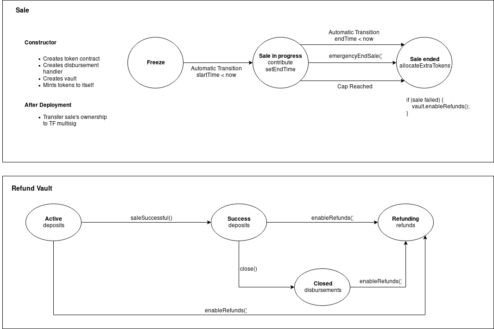

# sale-contracts
[](https://badge.fury.io/js/%40tokenfoundry%2Fsale-contracts)
[](https://coveralls.io/github/tokenfoundry/sale-contracts)

Code for the new token foundry token and sale base contracts.

## Contracts

- [Whitelistable.sol](/contracts/Whitelistable.sol): Base contract that implements a signature based whitelisting mechanism.
- [DisbursementHandler.sol](/contracts/DisbursementHandler.sol): Contract that is used by the sale to lock tokens until a certain timestamp.
- [Disburser.sol](/contracts/Disburser.sol): Handles all the interactions with the disbursement handler.
- [Sale.sol](/contracts/Sale.sol): Base contract from which all sales inherit. It implements a basic sale structure and common functions. It inherits from `Ownable`, `Whitelistable`, `TimedStateMachine`, `Disburser` and `TokenControllerI`.
- [Vault.sol](/contracts/Vault.sol): Contract that is used by the sale to store the funds and enable refunds or allow disbursements for the project team.

## Sale Structure

### Overview

We use a simple sale structure where the price of a token is the same for all contributors. The price is calculated as (tokens for sale) / (total wei raised), at the end of the sale. 

#### Whitelisting

Instead of storing in the contract the users that are allowed to contribute, we use a signature based whitelisting.

After the user goes through an _off-chain_ KYC process, we compute the keccak256 hash of the contributor's address concatenated with the _current sale cap_ and their _contribution limit_, and sign that hash using the whitelisting admin's private key. The user will have to contribute from the provided address, and will have to pass as argument to the contribute function the current sale cap, contribution limit and the signature.

##### Sale phases

The current sale cap is a variable set by the whitelisting admin, by signing its current value as part of the whitelisting of a contribution. This cap may be less than the totalSaleCap at a given moment in time, as sales can happen in phases - for example with 50% of tokens being sold in the first phase, and a further 50% being sold in a second phase. With this we achieve an _off-chain_ segmentation of different sale phases that can have different sale caps.

#### Refunds

All funds are immediatly sent to the `Vault` contract (the Sale contract doesn't store funds). Those funds are locked, and if at the end of the sale the minimum threshold is **not** reached, 100% of the funds are available for refunds. If at some point in the sale the minimum thresold is reached, a percentage of the funds is sent to the project team's wallet, and the rest is kept (locked) in the vault until the team publishes their contracts on testnet.

The `Vault` contract should be owned by a multisig wallet, as the owner is able to force refunds at any moment.

### State



### Flow

TODO

## Instructions

In order to build and test the contracts found in this repo, [Truffle](truffleframework.com) version > 4 is needed.

### Usage

First install as a npm package in your truffle project directory:

`yarn add -E @tokenfoundry/sale-contracts`

Import in your contracts:

```
import "@tokenfoundry/sale-contracts/contracts/Sale.sol";

contract MySale is Sale {
  ...
}
```

### Building

Once the repo is cloned, run `yarn install` to install all the dependencies.

Running `yarn compile` will compile the contract code and place the output in the `build/contracts` directory.

### Testing

`yarn test` to run all the tests, or `yarn test test/<test file>` to run a specific test.

`yarn coverage` to run tests and get code coverage.

## License

MIT
